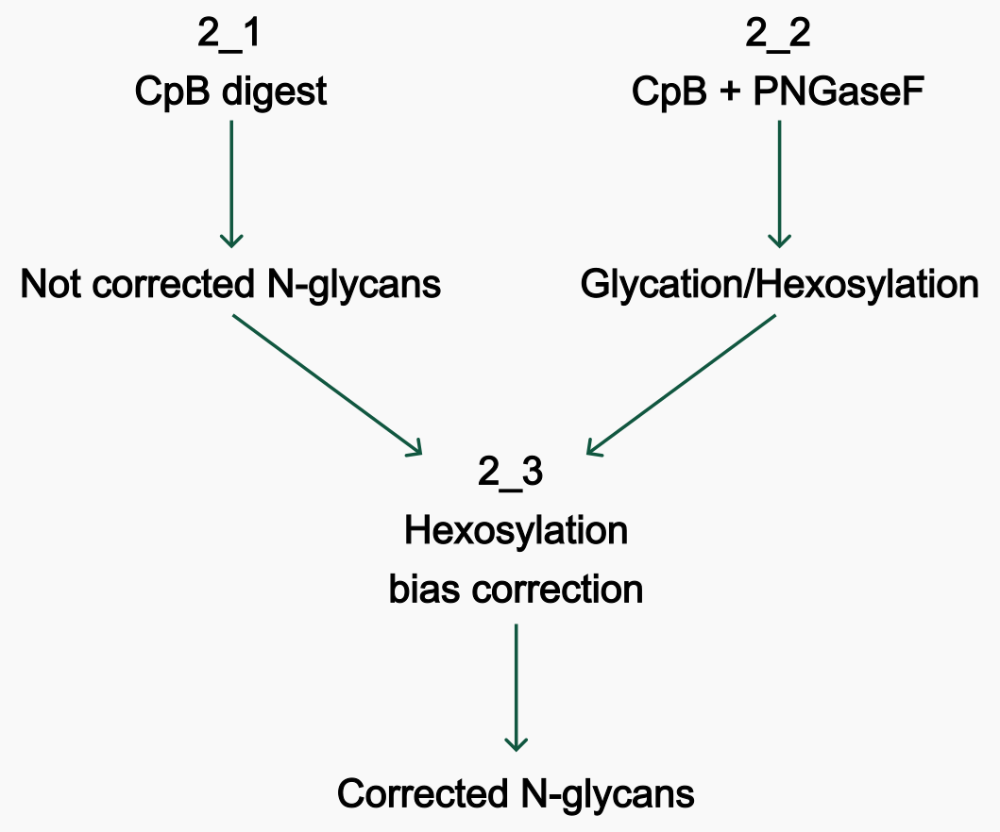

# Characterisation of large transgene integrations in Chinese hamster ovary cells using a bioengineered mammalian transposase

This repository complements the publication by Marx et al (2024) (https://doi.org/10.1002/btpr.3524)

## Folders

(Not all of these folders appear in the gitHub repository.)

-   `data`: raw input files and tables
-   `analysis`: output tables generated by the scripts in this repository
-   `figures`: plots generated by the plotting scripts
-   `mab_sequence`: fasta file containing the sequence of the monoclonal antibody (mAb) trastuzumab ([Drugbank](https://go.drugbank.com/drugs/DB00072))

## Analysis description

Download the folders containing raw data, intermediary files, and all figures from the following Zenodo link:. Unzip the folders data, analysis and figures to the folder containing the code of this repository. Open Herceptin_November_2023.Rproj and run renv::restore() to install all necessary libraries. 
This repository contains scripts for the following analysis:

**1. Quantification of the mAb subunits from the peak areas of UV-chromatograms**

[plot_subunits.R](plot_subunits.R) - Loads csv table with the subunits quantification and plots stacked barplot.
-   Input: data/1_subunit_quantification/RelQuantIntact01.csv
-   Output: Saves stacked barplot figure_8.png in the folder `figures/1_subunit_quantification`

**2. Quantification and hexose bias correction of N-glycans attached to the Fc region of the mAb**

Overall, the analysis workflow in this section is illustrated in the following figure. 

2_1. Quantification of hexose-bias not corrected N-glycans abundance

[analyse_all_files.R](analyse_all_files.R) - Using the package [fragquaxi](https://github.com/cdl-biosimilars/fragquaxi), quantify the abundance of N-glycans in the input mzml files. 
- Input: all mzml files in the directory `data/2_nglycans_quantification/2_1_not_corrected_glycans/intact_input_data` and `data/2_nglycans_quantification/2_1_not_corrected_glycans/rt_seconds_Jan2024_cs42_53_intact.csv` 
- Output: Each mzml file will have the quantified table saved into a folder with the file name, e.g. analysis/2_nglycans_quantification/2_1_not_corrected_glycans/intact_output_tables/20240125_TB_A2_1_CpB_11/frac_ab_tb_cs50.csv

[plot_sample.R](plot_sample.R) - Plot the not corrected N-glycans as a fractional abundance bar plot. 
- Input: Abundance quantification tables from analysis/2_1_not_corrected_glycans/intact_output_tables/ 
- Output: Figure 2_1_not_corrected_glycans.png in figures/2_nglycans_quantification/2_1_not_corrected_glycans/, merged dataset in analysis/2_nglycans_quantification/2_1_not_corrected_glycans/intact_output_tables/abundance_data.RData

2_2. Quantification of glycation (hexosylation)

[analyse_all_files_pngase.R](analyse_all_files_pngase.R) - Using the package [fragquaxi](https://github.com/cdl-biosimilars/fragquaxi), quantify abundance of hexoses (glucose molecules) in the input mzml files. 
- Input: all mzml files in the directory `data/2_nglycans_quantification/2_2_pngaseF_cpb/pngase_cpb_input_data`, data/2_nglycans_quantification/2_2_pngaseF_cpb/rt_seconds_Jan2024_pngase.csv 
- Output: Each mzml file will have the quantified table saved into a folder with the file name, e.g. analysis/2_nglycans_quantification/pngase_cpb_output_tables/20240125_TB_A16_1_CpB_PNGase_111/frac_ab_tb_cs50.csv

[plot_sample_pngase.R](plot_sample_pngase.R) - Plot the abundance of hexoses. 
- Input: Abundance quantification tables from analysis/2_nglycans_quantification/pngase_cpb_output_tables/ 
- Output: Two figures hexosylation_heatmap.png and supplementary_figure_3.png in figures/2_nglycans_quantification/2_2_pngaseF_cpb/, merged dataset in analysis/2_nglycans_quantification/pngase_cpb_output_tables/abundance_data_cpb_pngase.RData

2_3. Correction of hexose (glycation) bias and final quantification of corrected N-glycans abudance

[prepare_data_cafog.R](prepare_data_cafog.R) - Assembles all data required for the CAFOG analysis
-   Input: Results of 2_1 and 2_2 - uncorrected N-glycan abundance data abundance_data.RData and glycation data abundance_data_cpb_pngase.RData located in the folders `analysis/2_nglycans_quantification/2_1_not_corrected_glycans/intact_output_tables/abundance_data.RData`, `analysis/2_nglycans_quantification/pngase_cpb_output_tables/abundance_data_cpb_pngase.RData`.
- Output: For each sample, a single folder with tables for glycation.csv, glycosylation.csv and glycan_library.csv will be produced in the folder `analysis/2_nglycans_quantification/2_3_cafog_corrected_glycans`

[subprocess_cafog.ipynb](subprocess_cafog.ipynb) - Uses the hexose bias correction algorithm [cafog](https://github.com/cdl-biosimilars/cafog) to correct N-glycan abundances for hexosylation bias

**Note: Copy [subprocess_cafog.ipynb](subprocess_cafog.ipynb) to cafog folder to run directly from the source & base_folder in .ipynb must be changed to match the directory of `analysis/2_nglycans_quantification/2_3_cafog_corrected_glycans`
-   Input: For each sample, a single folder with tables for glycation.csv, glycosylation.csv and glycan_library.csv located in `analysis/2_nglycans_quantification/2_3_cafog_corrected_glycans`
-   Output: Corrected N-glycan abundances saved as results.csv in the respective `analysis/2_nglycans_quantification/2_3_cafog_corrected_glycans` folder 

[plot_sample_cafog_corrected.R](plot_sample_cafog_corrected.R) - Plots the corrected N-glycan abundances either as a barplot Figure 9. or as a heatmap Figure 10.
-   Input: Corrected N-glycan abundances saved as results.csv in the respective `analysis/2_nglycans_quantification/2_3_cafog_corrected_glycans` folder
-   Output: saved Figures 9. and 10. in the folder `figures/2_nglycans_quantification/2_3_cafog_corrected_glycans` and corrected N-glycans abundance dataset corrected_abundance_data.RData in `analysis/2_nglycans_quantification/2_3_cafog_corrected_glycans`

**3. Quantification of lysine variants and glycation on the intact mAb**

[analyse_all_files_pngase_lysine.R](analyse_all_files_pngase_lysine.R) - Using the package [fragquaxi](https://github.com/cdl-biosimilars/fragquaxi), quantify lysine and glycation in the input mzml files 
-   Input: all mzml files in the directory `data/3_lysine_glycation_quantification/pngase_input_data`,`data/3_lysine_glycation_quantification/rt_seconds_pngase.csv`
- Output: Each mzml file will have the quantified table saved into a folder with the file name, e.g. `analysis/3_lysine_glycation_quantification/pngase_output_tables/20231123_TB_A2_1_pngase_1_111/frac_ab_tb_cs50.csv`

 [plot_sample_lysine_glucose.R](plot_sample_lysine_glucose.R) - Plots the lysine and glycation fractional abundances as a barplot Figure 11.
- Input: Abundance quantification tables from `analysis/3_lysine_glycation_quantification/pngase_output_tables/` 
- Output: Two figures figure_11.png and lysine_hexosylation_heatmap.png in `figures/3_lysine_glycation_quantification/`, merged dataset in `analysis/3_lysine_glycation_quantification/pngase_output_tables/abundance_data_lysine_glucose.RData`